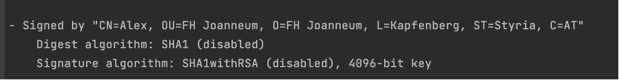
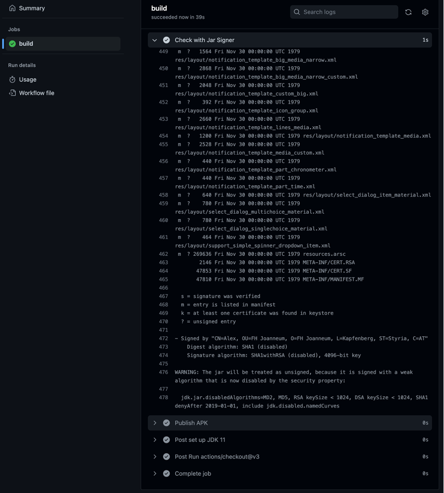

# Exercise 4
## Part 1
### Generate keystore
```bash 
keytool -genkey -v -keystore android-keystore.jks -alias playstore -keyalg RSA -keysize 4096 - validity 10000 -sigalg SHA256withRSA
```
### Gradle setup

### Build signed APK

### Verify signature
```bash
jarsigner -verify -verbose -certs Application/build/outputs/apk/releaseApplication-release.apk
```


## Part 2/3
### Workflow
```yml
name: Android CI

on:
  push:
    branches: [ "main" ]
  pull_request:
    branches: [ "main" ]

jobs:
  build:
    runs-on: ubuntu-latest
    steps:
    - uses: actions/checkout@v3
    - name: set up JDK 11
      uses: actions/setup-java@v3
      with:
        java-version: '11'
        distribution: 'temurin'
        cache: gradle

    - name: Prepare Keystore and properties
      run: |
        echo "${{secrets.ANDROID_KEYSTORE}}" > android-keystore.asc
        gpg -d --passphrase "${{secrets.ANDROID_KEYSTORE_PASSPHRASE}}" --batch android-keystore.asc > android-keystore.jks
        echo "storePassword=${{secrets.ANDROID_KEYSTORE_PASSPHRASE}}" >> gradle.properties
        echo "keyPassword=${{secrets.ANDROID_KEYSTORE_PASSPHRASE}}" >> gradle.properties

    - name: Grant execute permission for gradlew
      run: chmod +x gradlew
    - name: Build with Gradle
      run: ./gradlew Application:assembleRelease

    - name: Check with Jar Signer
      run: jarsigner -verify -verbose -certs Application/build/outputs/apk/release/Application-release.apk

    - name: Publish APK
      uses: actions/upload-artifact@v3
      with:
        name: Application-release.apk
        path: Application/build/outputs/apk/release/Application-release.apk
```
### Action


## Question
**Wie können zB Tester auf die APK zugreifen, um diese auf das Smartphone zu installieren und die App zu verwenden? Gibt es dazu geeignete GitHub Actions?** 

Man könnte die APK per SSH auf einen restricted Webserver spielen um diese intern den Testern zur Verfügung zu stellen.